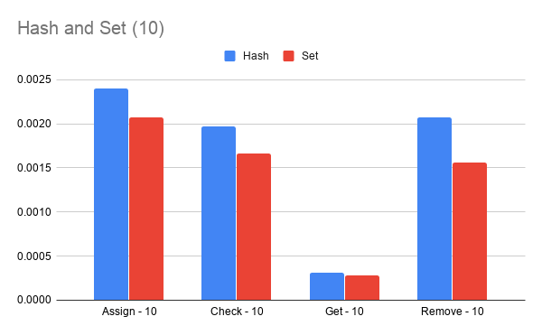
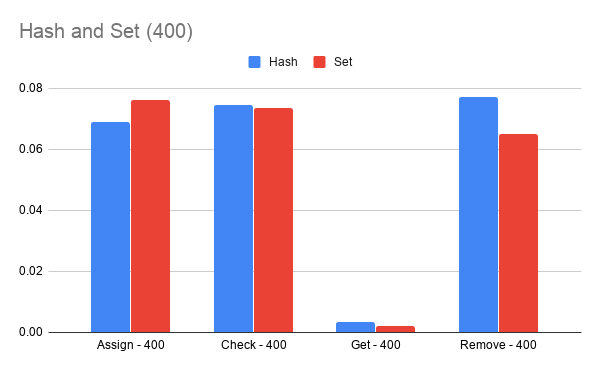
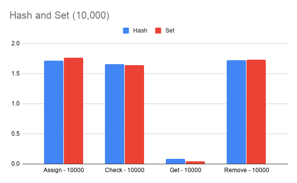
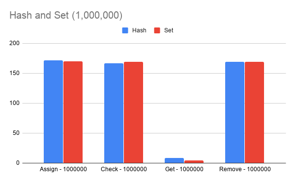

# data model

When designing deathnut, two approaches for redis id storage were considered: using redis sets and
using redis hashes.

## sets

redis sets are unordered collections of strings. The core deathnut operations (assign a role, check
a role, revoke a role) could be performed as:

```bash
# assign a role
redis:6379> SADD dimsum_edited-recipes:jennifer:view 85a9082e-e5c8-454c-b020-ac168ce91669
(integer) 1
# check a role
redis:6379> SISMEMBER dimsum_edited-recipes:jennifer:view 85a9082e-e5c8-454c-b020-ac168ce91669
(integer) 1
# revoke a role
redis:6379> SREM dimsum_edited-recipes:jennifer:view 85a9082e-e5c8-454c-b020-ac168ce91669
(integer) 1
redis:6379> SISMEMBER dimsum_edited-recipes:jennifer:view 85a9082e-e5c8-454c-b020-ac168ce91669
(integer) 0
```

## hashes

redis hashes are hashes that map string names to string values. This is the datastruture actually
utilized by the "low level" deathnut client (and the various interfaces built on top).

The hash approach equivalent of the above set commands:

```bash
# assign a role
redis:6379> HSET dimsum_edited-recipes:jennifer:view 85a9082e-e5c8-454c-b020-ac168ce91669 T
(integer) 1
# check a role
redis:6379> HGET dimsum_edited-recipes:jennifer:view 85a9082e-e5c8-454c-b020-ac168ce91669
"T"
# revoke a role
redis:6379> HDEL dimsum_edited-recipes:jennifer:view 85a9082e-e5c8-454c-b020-ac168ce91669
(integer) 1
# re-check
redis:6379> HGET dimsum_edited-recipes:jennifer:view 85a9082e-e5c8-454c-b020-ac168ce91669
(nil)
```

## so why hashes over sets

In [redis docs on memory optimization](https://redis.io/topics/memory-optimization) they encourage
using hashes "when possible." The documentation there is excellent for a full overview of what's
going on, but suffice to say using hashes allows redis to store the hash key-values more efficiently
in memory (as a ziplist up to a certain threshold) as well as take advantage of cache locality
benefits.

The drawbacks of using a hash approach over sets are that we cannot assign TTLs to hash fields and
the keys and values can only be strings. Lack of TTL is not a concern for us because we never
want these keys to expire anyway. That the keys and values must be strings is also not a limiting
concern as for the user object keys should always be uuids (strings) and all we care about is
whether they are set or not, which we can represent perfectly well with a "T".

The hashing approach should save some memory early on (when the k,v in a field are less than redis'
hash-max-ziplist number). Once the number of entries in a hash field exceeds hash-max-ziplist the
key-value pairs will be 'unzipped' to a regular hash.

A test script (see below) was created to evaluate the approaches as n grew in size.

Hash vs Set when n = 10:\


Hash vs Set when n = 400:\


Hash vs Set when n = 10,000:\


Hash vs Set when n = 1,000,000:\



From an analysis standpoint the approaches are nearly identical. Hash uses less memory when n is
small but is slightly slower. Hash uses *more* memory once n exceeds the hash-max-ziplist setting
(512 by default and in the testing below) but gets *faster* for 'checks' as n gets very large.
The only significant difference as n grows is the set approach performs about twice as fast for
'get all ids for role'.

Hash will provide a memory savings for the majority of our data (users with few roles) while also
performing slightly better for the use case we probably care about the most (checks) when n is
large.

## the test script

```python
"""
Tests time and space performance of redis data strategies for:
1) Assign role
2) Check role
3) Remove role
4) Get ids for user, role
"""
import functools
import itertools
import time
import uuid

import docker
import redis

USER = "michael"
SERVICE_NAME = "dimsum_edited-recipes"
PERMISSION = "view"
TEST_SIZES = [10, 400, 10000, 1000000]
TEST_RUNS_PER_SIZE = 10

docker_client = docker.from_env()
for container in docker_client.containers.list(all=True):
    container.remove(force=True)

# https://www.peterbe.com/plog/understanding-redis-hash-max-ziplist-entries
docker_client.containers.run("redis:3.2.5-alpine", name="redis", ports={'6379/tcp': 6379}, detach=True)
time.sleep(5)

def time_me(func):
    @functools.wraps(func)
    def timed(*args, **kwargs):
        t0 = time.time()
        func(*args, **kwargs)
        t1 = time.time()
        return t1 - t0
    return timed

def generate_ids(size):
    results = size * [None]
    for i in range(size):
        results[i] = str(uuid.uuid4())
    return results

class BaseImplementation(object):
    def __init__(self):
        self.redis_client = redis.Redis(host='localhost')
    def flush(self):
        self.redis_client.flushall()
    def memory_info(self):
        memory_size = int(self.redis_client.info()['used_memory']) / 1024 / 1024
        print('Memory size (mb): ', memory_size)
class HashImplementation(BaseImplementation):
    def __init__(self):
        super(HashImplementation, self).__init__()
    @time_me
    def assign_role(self, resource_ids):
        for r_id in resource_ids:
            self.redis_client.hset("{}:{}:{}".format(SERVICE_NAME, USER, PERMISSION), r_id, "T")
    @time_me
    def check_role(self, resource_ids):
        for r_id in resource_ids:
            self.redis_client.hget("{}:{}:{}".format(SERVICE_NAME, USER, PERMISSION), r_id)
    @time_me
    def remove_role(self, resource_ids):
        for r_id in resource_ids:
            self.redis_client.hdel("{}:{}:{}".format(SERVICE_NAME, USER, PERMISSION), r_id)
    @time_me
    def get_ids_for_user_and_role(self, limit):
        return self.redis_client.hgetall("{}:{}:{}".format(SERVICE_NAME, USER, PERMISSION))
class SetImplementation(BaseImplementation):
    def __init__(self):
        super(SetImplementation, self).__init__()
    @time_me
    def assign_role(self, resource_ids):
        for r_id in resource_ids:
            self.redis_client.sadd("{}:{}:{}".format(SERVICE_NAME, USER, 'view'), r_id)
    @time_me
    def check_role(self, resource_ids):
        for r_id in resource_ids:
            self.redis_client.sismember("{}:{}:{}".format(SERVICE_NAME, USER, 'view'), r_id)
    @time_me
    def remove_role(self, resource_ids):
        for r_id in resource_ids:
            self.redis_client.srem("{}:{}:{}".format(SERVICE_NAME, USER, 'view'), r_id)
    @time_me
    def get_ids_for_user_and_role(self, limit):
        return self.redis_client.smembers("{}:{}:{}".format(SERVICE_NAME, USER, 'view'))

for strat in [HashImplementation, SetImplementation]:
    curr_strat = strat()
    print('\nCurrent strategy: ', curr_strat.__class__)
    for test_size in TEST_SIZES:
        assign_time = check_time = remove_time = get_ids_time = 0.0
        print('Current size: ', test_size)
        for run_number in range(0, TEST_RUNS_PER_SIZE):
            curr_strat.flush()
            resource_ids = generate_ids(test_size)
            assign_time += curr_strat.assign_role(resource_ids)
            check_time += curr_strat.check_role(resource_ids)
            if run_number == 0:
                curr_strat.memory_info()
            get_ids_time += curr_strat.get_ids_for_user_and_role(limit=test_size)
            remove_time += curr_strat.remove_role(resource_ids)
        print('Average assign time for size {}: {}'.format(test_size, (assign_time / TEST_RUNS_PER_SIZE)))
        print('Average check time for size {}: {}'.format(test_size, (check_time / TEST_RUNS_PER_SIZE)))
        print('Average get_ids time for size {}: {}'.format(test_size, (get_ids_time / TEST_RUNS_PER_SIZE)))
        print('Average remove time for size {}: {}\n'.format(test_size, (remove_time / TEST_RUNS_PER_SIZE)))
```

## the results

```json
Current strategy:  <class 'main.HashImplementation'>
Current size:  10
Memory size (mb):  0.7845611572265625
Average assign time for size 10: 0.002396035194396973
Average check time for size 10: 0.0019696712493896484
Average get_ids time for size 10: 0.00030748844146728517
Average remove time for size 10: 0.002073073387145996

Current size:  400
Memory size (mb):  0.8026885986328125
Average assign time for size 400: 0.06910338401794433
Average check time for size 400: 0.07464370727539063
Average get_ids time for size 400: 0.003460550308227539
Average remove time for size 400: 0.0771059274673462

Current size:  10000
Memory size (mb):  1.9000701904296875
Average assign time for size 10000: 1.714552116394043
Average check time for size 10000: 1.6565654039382935
Average get_ids time for size 10000: 0.08267109394073487
Average remove time for size 10000: 1.7245433807373047

Current size:  1000000
Memory size (mb):  107.96537780761719
Average assign time for size 1000000: 171.28733401298524
Average check time for size 1000000: 166.97685203552246
Average get_ids time for size 1000000: 8.734644222259522
Average remove time for size 1000000: 169.25652508735658


Current strategy:  <class 'main.SetImplementation'>
Current size:  10
Memory size (mb):  0.785736083984375
Average assign time for size 10: 0.0020684719085693358
Average check time for size 10: 0.001663064956665039
Average get_ids time for size 10: 0.0002766132354736328
Average remove time for size 10: 0.0015640974044799805

Current size:  400
Memory size (mb):  0.81927490234375
Average assign time for size 400: 0.07611594200134278
Average check time for size 400: 0.07368333339691162
Average get_ids time for size 400: 0.0020056247711181642
Average remove time for size 400: 0.06507678031921386

Current size:  10000
Memory size (mb):  1.67279052734375
Average assign time for size 10000: 1.7643103837966918
Average check time for size 10000: 1.637847900390625
Average get_ids time for size 10000: 0.042533040046691895
Average remove time for size 10000: 1.7352761268615722

Current size:  1000000
Memory size (mb):  85.07879638671875
Average assign time for size 1000000: 169.62985651493074
Average check time for size 1000000: 168.92308237552643
Average get_ids time for size 1000000: 4.649837374687195
Average remove time for size 1000000: 169.36373128890992

```
